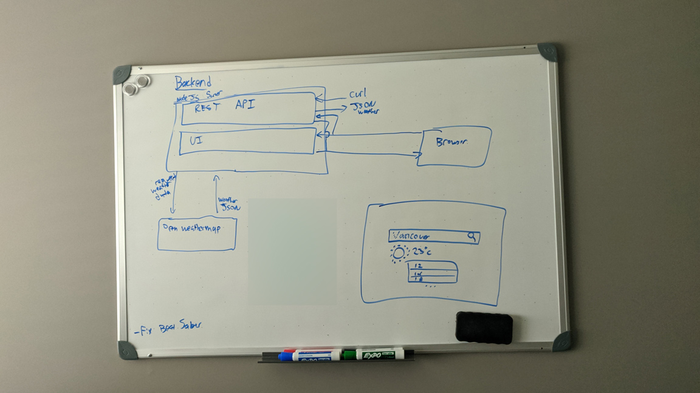
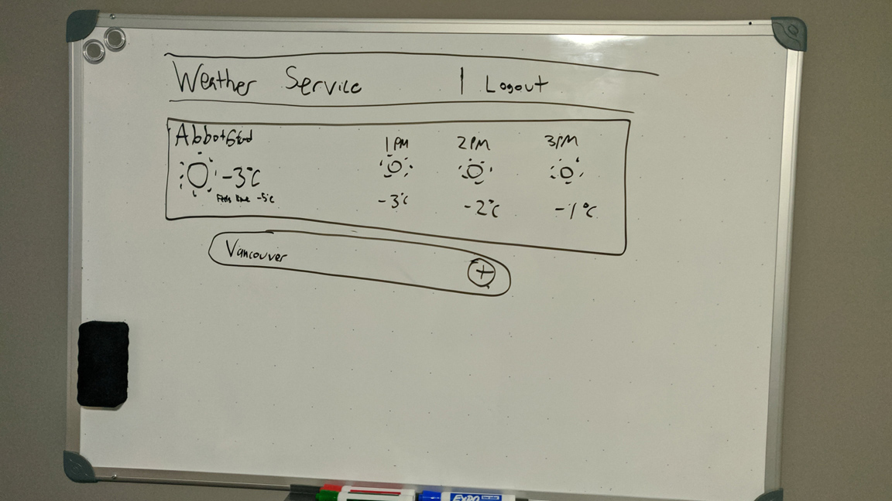
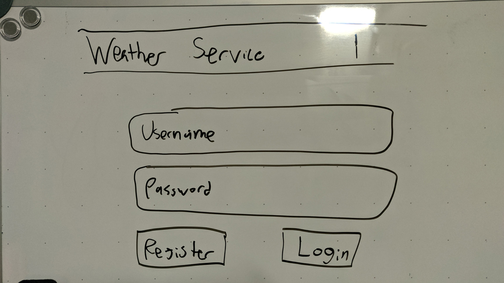

# Weather Service
A NodeJS solution to view weather data on any location via browser or through the REST API

## Notes
### Planning Phase
The goal of this project was to come up with some way to proxy weather data from a real source, extract only the data I think would be needed, and send that back. On top of that I wanted some way to include a front-end portion.
I debated between what to use. I have experience in NodeJS w/ the Express framework. Some NodeJS projects like [a discord bot](https://github.com/duecknoah/basic_bot) and [a twitch bot](https://github.com/duecknoah/tmi_bots). However more recently I've been learning Flask and working on a project to scrape and chart [reddit analytics](https://github.com/wilshum/Reddit-Analytics). Flask is good for getting started quickly, and NodeJS has a lot of support and is something I'd like to get even more familiar with. I also feel more comfortable in Node, so I decided to go with that as my backend.

With that in mind I wanted to chart out a little more of how the front-end would look. I wanted the user to be able to:
- register an account
- login/logout
- add or remove weather entries of different cities and have that info stored on their account for anytime they login

*Project diagram and intial front-end plan (bottom-left)*

*Main page for viewing weather data and adding new cities*

*Login/Register account page*

On top of this I wanted to deploy this all on a platform to host. I decided to use a well-known PAAS called Heroku to host. Which will allow me to do this for free as well and host my NodeJS instance. Since I'll want to store user data which is perfect since they also provide a DB to use.

## Setup Phase
Modules used and reasoning:
- [**Express**](https://www.npmjs.com/package/express) - I could have used the basic http module and used http.createServer(...) to handle incoming requests. However Express provides an elegant and easy way - to create endpoints, plus I'm already familiar with it.
- [**node-fetch**](https://www.npmjs.com/package/node-fetch) - Very similiar to window.fetch in Javascript in the browser, this allows me to get a Promise of a request. Needed for proxying between the user and [open weather map](https://openweathermap.org/).
- [**cors**](https://www.npmjs.com/package/cors) - Allows us to communicate between react and our api endpoints on Express

I created an account for getting weather data and found [current](https://openweathermap.org/current) and [hourly](https://openweathermap.org/forecast5) API endpoints to use. I also created a Heroku account to deploy later on.

## Working Phase
- I realized there was no simple way for Heroku to get my API key and use it from a file (my original solution). So I had to get rid of the file solution and implement an environment variables solution with an env.bat file
- I decided to use React as the UI library, however my project was created already. Had some permissions issues involving network drives and installing the react-scripts. Found a [helpful tutorial](https://medium.com/@fredrikanderzon/adding-create-react-app-scripts-to-an-existing-project-207cfe3cd190). Unfortunately some issues still persisted so I create a new react app entirely and manually merged into this repo.
- I couldn't wrap my head fully around how to link Express and React together. With a little bit of hair pulling I figured out running both concurrently requires having the React app in its own folder within the repo. Then setting package.json to run a postbuild script on Heroku to build React and run it as well. See [how to deploy](https://daveceddia.com/deploy-react-express-app-heroku/#:~:text=Now%20start%20up%20the%20React,the%20whole%20thing%20to%20Heroku.)
- I get data to the front-end by having React and Express running on separate ports. Then having React make GET requests to Express's API and having that update the state of the components. Since They are running on separate ports CORS is needed.
-

### Date
**The date you're submitting this.**

### Location of deployed application
**If applicable, please provide the url where we can find and interact with your running application.**

### Time spent
How much time did you spend on the assignment? Normally, this is expressed in hours.

- Planning - 2 hours
- Setup - 1 hour
- Implementing hourly and current api endpoints with documentation - 2 hours
- Filling out Readme - 1 hour
- Linting - 30 minutes
- Error handling - 30 minutes
- Heroku deployment and environment variable setup - 1 hour
- React setup and Heroku adjustments - 3 hours (some issues)
- Weather widget w/ communication to backend api - 2 hours

### Assumptions made
**Use this section to tell us about any assumptions that you made when creating your solution.**
- Deploying with React+Express to Heroku would be simple. It proved to be the main time killer.
- React being somewhat similiar to UI5 at SAP. Making it easier to learn.

### Shortcuts/Compromises made
**If applicable. Did you do something that you feel could have been done better in a real-world application? Please let us know.**

### Stretch goals attempted
**If applicable, use this area to tell us what stretch goals you attempted. What went well? What do you wish you
could have done better? If you didn't attempt any of the stretch goals, feel free to let us know why.**

1. **Build a simple UI for the service**
2. **Add authentication to the service**
3. **Deploy your API**
4. **Proxy a real weather API via your service to fetch the actual weather.**
     - I used [open weather map](https://openweathermap.org/) to fetch [current](https://openweathermap.org/current) and [hourly](https://openweathermap.org/forecast5) weather data for different cities. This worked surpringsly easily along with the node-fetch module. The membership is free and allows for what I needed in this project.

### Instructions to run assignment locally
**If applicable, please provide us with the necessary instructions to run your solution.**
1. `npm install`
2. Open env.bat and put in API key for openweatherorg
3. `\env.bat`
4. `npm run dev`

- If runninng locally, to hit API endpoints (Express):
   - http://localhost:5000/api/...
- To hit main page (React):
  - http://localhost:3000/

If running on heroku, run `heroku config:set API_KEY=YOUR_API_KEY_HERE`

### What did you not include in your solution that you want us to know about?
**Were you short on time and not able to include something that you want us to know
about? Please list it here so that we know that you considered it.**

A [reference to helpful videos](https://www.youtube.com/playlist?list=PLK1RhMgTzsChttnZgT0ck_fbK3_iW9nBg) that assisted me

### Other information about your submission that you feel it's important that we know if applicable.
Some ideas that didn't quite make the cut (either to complexity, no access to an API, or lack of expandibility):
- Get weather of planets in the solar system. Have a space themed UI
  - no real world API to query live planet weather data. This would miss one of the stretch goals
- Get the time and weather of Minecraft servers
  - biome and position dependent, would need a live server not to crash. Would make sense if had access to multiple servers. Can't see a real use case here for me

### Your feedback on this technical challenge
**Have feedback for how we could make this assignment better? Please let us know.**